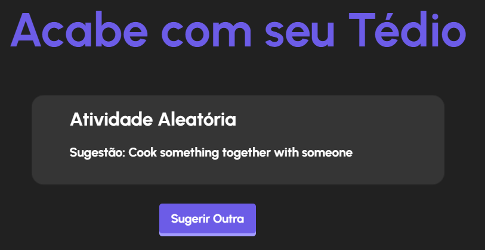

#  💡⚡ *FIM DO TÉDIO* ⚡💡

### **Imagem:**

- ### Acesse o projeto: [Clique aqui](http://server-andrey.unaux.com/tedio/) 

### **Descrição:** 
Este repositório contém um projeto web simples que usa a API "Bored API" com PHP. A aplicação é um exemplo prático que utiliza conceitos simples de PHP para fazer solicitações à "Bored API" e exibir atividades aleatórias que podem "combater o tédio".

### **Contato**:
- Nome: Andrey da Silva Pereira
- Email: [andrey08.ap@gmail.com](mailto:andrey08.ap@gmail.com)

